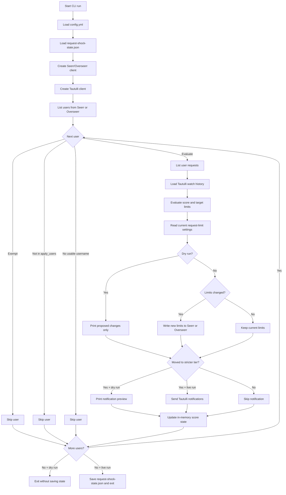
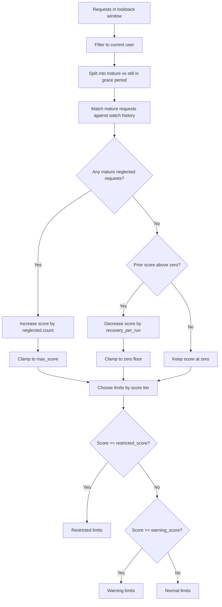
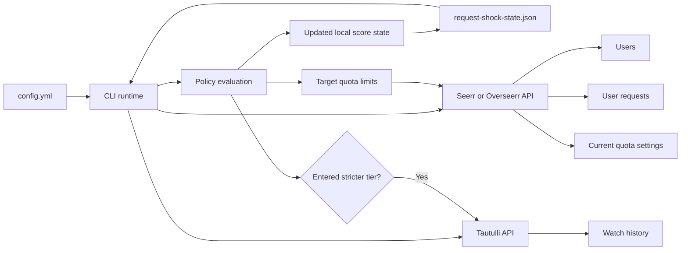

# Flow Charts and Runtime Notes

This document turns the policy into a set of quick reference diagrams so it is easier to understand what the job does on each run, how a user's score changes, and which external systems are involved.

## End-to-End Run Flow

## Score Evaluation Flow

### Matching Rules Used During Evaluation

- Only requests inside `lookback_days` are considered.
- A movie becomes mature after `movie_grace_days`.
- A TV season becomes mature after `tv_grace_days`.
- Movie requests count as watched when playback reaches at least `min_movie_fraction`.
- TV requests count as watched when the user has watched at least `max(min_tv_episodes, floor(episode_count * min_tv_fraction))` distinct episodes for the requested season.
- Request/watch matching prefers overlapping external IDs (`tmdb`, `tvdb`, `imdb`) and falls back to normalized title matching.

## Integration and Data Flow

## Configuration-to-Behavior Map

| Config area | What it controls |
| --- | --- |
| `seerr` / `overseerr` | Which request-manager API is updated with the final quota override |
| `tautulli` | Where watch history comes from and where optional notifications are sent |
| `ignore_user_ids` / `exempt_users` | Users the policy never touches |
| `apply_users` | Optional allow-list for staged rollouts |
| `policy.normal_limits` | Quota values when score is below `warning_score` |
| `policy.warning_limits` | Quota values when score is at or above `warning_score` but below `restricted_score` |
| `policy.restricted_limits` | Quota values when score is at or above `restricted_score` |
| `policy.movie_grace_days` / `policy.tv_grace_days` | How long a request can age before it can count against a user |
| `policy.min_movie_fraction`, `policy.min_tv_fraction`, `policy.min_tv_episodes` | What "watched enough" means for movies and TV seasons |
| `policy.lookback_days` | How far back the evaluator looks for request history |
| `policy.recovery_per_run` / `policy.max_score` | Score decay and upper bound |
| `notifications` | Whether stricter-tier transitions trigger Tautulli notifier calls |

## Related Docs

- See [`../README.md`](../README.md) for setup, operations, and examples.
- See [`user-request-limit-update.md`](user-request-limit-update.md) for the end-user explanation of why limits may change.
